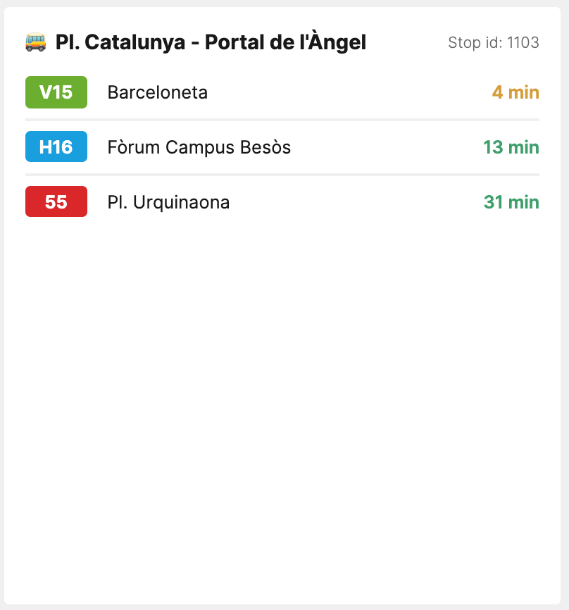

# TMB Bus tile for [Laravel Dashboard](https://docs.spatie.be/laravel-dashboard).

[](https://packagist.org/packages/dustycodecorp/laravel-dashboard-tmb-tile)
[](https://github.com/dustycodecorp/laravel-dashboard-tmb-tile/actions?query=workflow%3Arun-tests+branch%3Amaster)
[](https://packagist.org/packages/dustycodecorp/laravel-dashboard-tmb-tile)

This tile can display the bus status for a given bus stop of Barcelona



This tile can be used on [The Laravel Dashboard](https://docs.spatie.be/laravel-dashboard).

## Installation

You can install the package via composer:

```bash
composer require dustycodecorp/laravel-dashboard-tmb-tile
```

## Usage

**NOTE:** In order for this tile to work you will need the `app_id` and `app_key` from the 
[TMB developer website](https://developer.tmb.cat/) the registration process is free and once you get the credentials
you can ask for the information for as much stations as you want!.

In the `dashboard` config file, you must add this configuration in the `tiles` key.
`````php
// in config/dashboard.php

return [
    // ...
    'tiles' => [
        'tmb' => [
            'app_id' => 'Get this from the TMB developer web stie',
            'app_key' => 'Get this from the TMB developer web site',
            'refresh_interval_in_seconds' => 60,
            'stations' => [
                1103,
                1208
            ]
        ]  
    ]   
];
`````

In app\Console\Kernel.php you should schedule the `Dustycode\TmbTile\ListenForTmbUpdatesCommand` to run. You can let in run every minute if you want. You could also run is less frequently if you fast updates on the dashboard aren’t that important for this tile.

`````
// in app/console/Kernel.php

protected function schedule(Schedule $schedule)
{
    // ...
    $schedule->command(Dustycode\TmbTile\ListenForTmbUpdatesCommand::class)->everyMinute();
}
`````

In your dashboard view you use the `livewire:tmb-tile` component.

```html
<x-dashboard>
    <livewire:tmb-tile position="c1:c2" title="Pl. Catalunya - Portal de l'Àngel" stop-id="1103"/>
</x-dashboard>
```

The title attribute is optional


## Testing

``` bash
composer test
```

## Changelog

Please see [CHANGELOG](CHANGELOG.md) for more information on what has changed recently.

## Contributing

Please see [CONTRIBUTING](CONTRIBUTING.md) for details.

## Security

If you discover any security related issues, please email :author_email instead of using the issue tracker.

## Credits

- [All Contributors](../../contributors)
- [TMB API Sevices](https://developer.tmb.cat/)

## License

The MIT License (MIT). Please see [License File](LICENSE.md) for more information.
